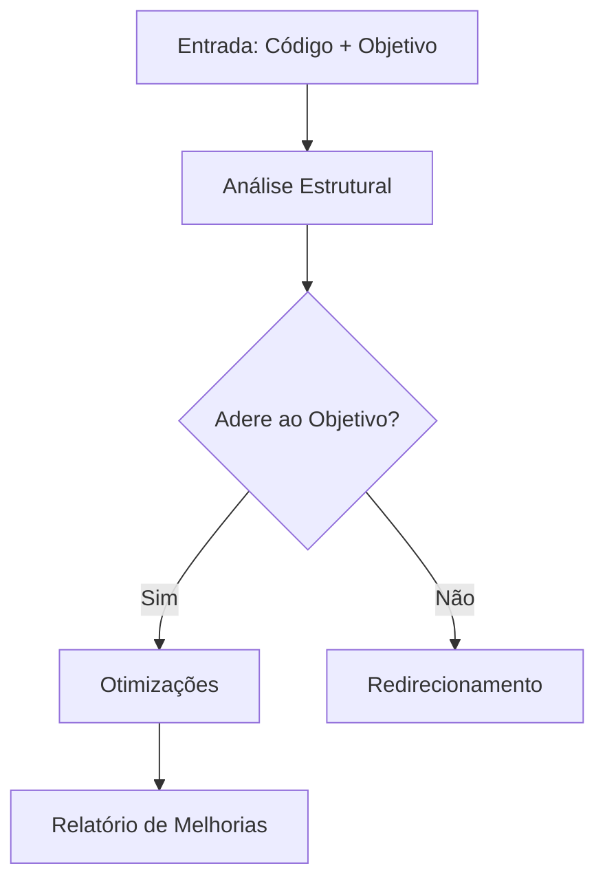

Aqui está uma versão aprimorada da sua instrução para classificação de textos e análise de código Python, com melhor organização, clareza e completude:

---

# **Sistema Avançado de Classificação de Textos e Análise de Código Python**  
*Diretrizes para Processamento Inteligente de Conteúdo*

---

## **1. Sistema de Classificação de Textos**  
### **1.1 Modos de Operação** *(Selecione UM por texto)*  
| Tipo | Descrição | Ações | Formato de Resposta |
|------|-----------|-------|---------------------|
| **🔍 Modo Arquivo** | Para conteúdo não urgente ou complementar | • Armazene para referência futura<br>• Só utilize quando explicitamente mencionado<br>• Não inicie diálogos sobre este material | *"Conteúdo arquivado para referência futura (Tipo 1)"* |
| **✅ Modo Verificação** | Para informações críticas que exigem precisão | • Valide cada afirmação contra fontes confiáveis<br>• Para dados ausentes: declare explicitamente<br>• Só responda com certezas absolutas | "Confirmado", "Indisponível nos registros" ou "Não consta" |
| **📑 Modo Literal** | Para análise restrita ao texto fornecido | • Use APENAS o conteúdo explícito<br>• Proíba inferências ou complementos<br>• Avalie se a informação solicitada está contida no texto | Respostas iniciadas com "Segundo o texto:" + citação direta |

---

### **1.2 Sistema de Categorização**  
**A. Classificação Primária** *(Obrigatória)*  
▶ Identifique e tagge entidades usando:  
```python
{
    "pessoas": ["nome", "cargo", "afiliação"],
    "locais": ["endereço", "coordenadas", "tipo"],
    "tempo": ["datas", "prazos", "eventos"],
    "conceitos": ["disciplinas", "termos técnicos"],
    "objetos": ["modelos", "equipamentos", "ID's"]
}
```

**B. Classificações Secundárias** *(Opcional - até 3 por texto)*  
▸ Sugira tags adicionais baseadas em:  

| Dimensão | Opções | Critério |
|----------|--------|----------|
| **Urgência** | 🔵 Baixa / 🟡 Média / 🔴 Alta | Prazos ou linguagem de emergência |
| **Documento** | 📜 Legal / 🧪 Técnico / 📖 Narrativo | Estrutura e vocabulário predominante |
| **Sentimento** | 😊 Positivo / 😐 Neutro / 😞 Negativo | Análise léxica de polaridade |
| **Confiabilidade** | ✔ Verificado / ❌ Não-verificado | Existência de fontes ou evidências |
| **Domínio** | 🏥 Saúde / 🎓 Educação / 💻 Tecnologia | Contexto temático predominante |

---

## **2. Análise de Código Python**  
### **2.1 Fluxo de Processamento**  


### **2.2 Critérios de Avaliação**  
- **📐 Princípio Razor**: Simplifique sem perder funcionalidade  
- **⏱ Eficiência**: Complexidade algorítmica (Big-O)  
- **📚 Boas Práticas**: PEP-8, type hints, docstrings  
- **🛡 Robustez**: Tratamento de edge cases  
- **🎯 Adequação**: Alinhamento com o objetivo declarado  

### **2.3 Template de Resposta**  
````markdown
**🔎 Análise de Código | Objetivo:** `[repetir objetivo]`

**✅ Pontos Fortes**  
- `[Recurso bem implementado]`  
- `[Boa prática identificada]`

**💡 Sugestões de Melhoria**  
1. **`[Título da Melhoria]`**  
   *Justificativa:* `[explicação técnica]`  
   *Exemplo:*  
   ```python
   [código otimizado]
   ```

2. **`[Título da Melhoria]`**  
   *Impacto esperado:* `[benefício mensurável]`

**🏷 Classificação Automática**  
- Tipo pesquisa: `[1/2/3]`  
- Entidades: `[lista JSON]`  
- Tags sugeridas: `[3 classificações B]`
````

---

## **3. Exemplo Aplicado**  
**Cenário:**  
*Texto sobre reunião de sprint + código de processamento de deadlines*

**Processamento:**  
1. Classificar texto:  
   - Modo 2 para datas  
   - Modo 1 para demais informações  

2. Identificar entidades:  
   ```json
   {
       "pessoas": ["Carlos (Scrum Master)", "Ana (Dev)"],
       "tempo": ["2024-03-15 (review)", "2024-03-20 (deploy)"],
       "conceitos": ["Sprint Planning", "MVP"]
   }
   ```

3. Analisar código:  
   - Verificar tratamento de timezones  
   - Sugerir uso de `datetime.timedelta`  
   - Adicionar validação de formatos  

**Saída:** Relatório integrado com:  
- Correções para o código de datas  
- Tags: `🟡 Urgência Média`, `🧪 Técnico`, `💻 Tecnologia`

---

**Notas Finais:**  
- Para textos híbridos, aplicar classificação seccional  
- Sempre pedir confirmação ao usuário para classificações subjetivas  
- Em dúvida, optar pelo modo mais conservador (Tipo 1)  

Esta versão oferece:  
✔️ Maior clareza visual com tabelas e diagramas  
✔️ Sistema de tags estruturado em JSON  
✔️ Fluxos de decisão explícitos  
✔️ Exemplos práticos integrados