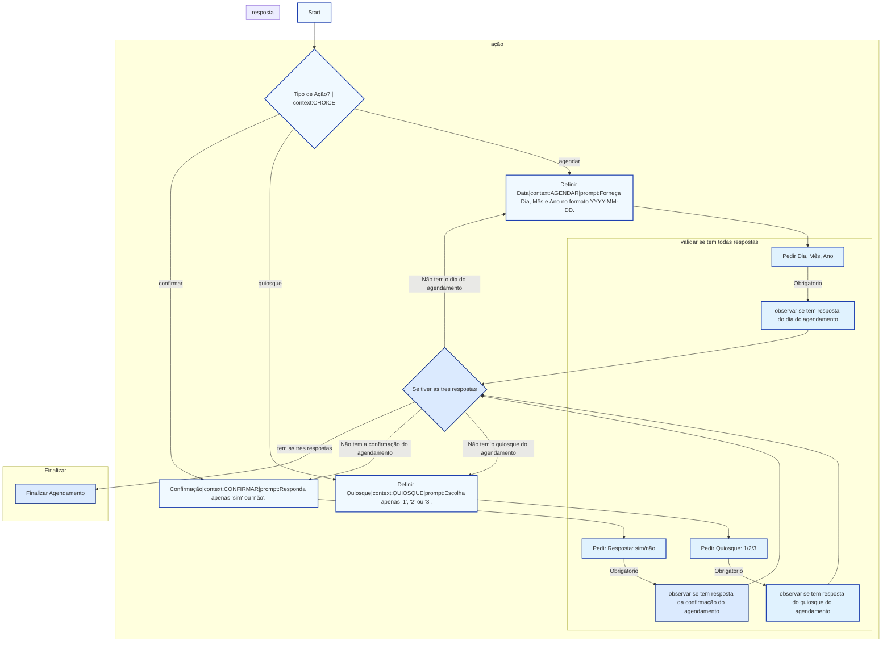

### Sequência de Instruções para Gerar Classes Python a partir de Fluxo Mermaid

---

#### 1. Receber o Fluxo Mermaid

* **Entrada**: string contendo o diagrama Mermaid. Exemplo:



* A IA deve **parsear** esse Mermaid em:

  * **Nodes**: extrair `id`, `label`, `context`, `prompt_template`
  * **Edges**: determinar a ordem de execução

---

#### 2. Aplicar Convenções de Nomenclatura

* Cada nó vira uma **classe** Python:

  ```python
  class Etapa_<ID>_<Slug(rótulo)>:
      ...
  ```
* Exemplo: nó `A[Start]` → `class Etapa_A_Start:`

---

#### 3. Gerar Esqueleto de Classe

```python
class Etapa_<ID>_<Slug>:
    """
    Etapa <ID>: <Rótulo>
    Convenções:
      - Métodos de IA: call_IA_geral / call_IA_especifica
      - Métodos de DB: query_vector_db_general / query_vector_db_specific
    """
    def __init__(self, config: Config):
        self.config = config

    def executar(self, input_data: Any) -> Any:
        # lógica específica da etapa
        pass
```

---

#### 4. Definir Métodos de Interação com a IA

```python
def call_IA_geral(prompt: str) -> str: ...
def call_IA_especifica(prompt: str) -> str: ...
```

* Retornam string ou JSON padronizado.

---

#### 5. Consulta ao Banco Vetorizado com Contexto Dinâmico

1. **Parser de Metadados do Mermaid**

```python
import re
from typing import NamedTuple, Dict

class NodeMeta(NamedTuple):
    id: str
    label: str
    context: str
    prompt_template: str


def parse_mermaid_nodes(diagram: str) -> Dict[str, NodeMeta]:
    pattern = r'(\w+)\["([^"|]+)\|context:(\w+)\|prompt:([^\"]+)"\]'
    metas = {}
    for match in re.finditer(pattern, diagram):
        node_id, label, ctx, prompt = match.groups()
        metas[node_id] = NodeMeta(
            id=node_id,
            label=label.strip(),
            context=ctx,
            prompt_template=prompt.strip()
        )
    return metas
```

2. **Métodos de Query**

```python
def query_vector_db_general(query: str) -> List[Document]: ...
def query_vector_db_specific(query: str, context: str) -> List[Document]: ...
```

3. **build\_prompt Dinâmico**

```python
def build_prompt(input_data: Any, node_meta: NodeMeta) -> str:
    return (
        f"Contexto: {node_meta.context}\n"
        f"Usuário: {input_data}\n"
        f"{node_meta.prompt_template}"
    )
```

4. **Uso no Fluxo**

```python
metas = parse_mermaid_nodes(diagram_str)
node = metas[self.id]                # metadados da etapa atual
prompt = build_prompt(input_text, node)
docs = query_vector_db_specific(prompt, node.context)
```

---

#### 6. Lógica de Fluxo Condicional Explícita

1. **Modelo de Resposta Tipada**

```python
from pydantic import BaseModel, validator
from datetime import date

class ChoiceResponse(BaseModel):
    context: str
    choice: Union[date, int, Literal["sim","não"]]

    @validator("choice")
    def check_choice(cls, v, values):
        ctx = values["context"]
        if ctx == "AGENDAR" and not isinstance(v, date):
            raise ValueError("Esperado YYYY-MM-DD")
        if ctx == "QUIOSQUE" and v not in (1,2,3):
            raise ValueError("Esperado 1, 2 ou 3")
        if ctx == "CONFIRMAR" and v not in ("sim","não"):
            raise ValueError("Esperado 'sim' ou 'não'")
        return v
```

2. **Fluxo de Execução**

```python
# 1. Gera o prompt
prompt = build_prompt(input_text, node)

# 2. Chama IA específica
resp_str = call_IA_especifica(prompt)

# 3. Parseia e valida
parsed = ChoiceResponse.parse_obj({
    "context": node.context,
    "choice": resp_str
})

# 4. Encaminha para o próximo nó
next_node = flow.get_next(self.id, parsed.choice)
TriggerN8nStep(node_id=next_node, payload=parsed.choice)
```

3. **Repetição em Caso de Erro**

```python
try:
    parsed = ChoiceResponse.parse_obj({...})
except ValidationError as e:
    return {
        "error": e.errors(),
        "hint": node.prompt_template
    }
```

---

#### 7. Geração de Arquivo de Configuração

```yaml
flow_diagram: "graph TD ..."
nodes:
  A:
    class: Etapa_A_Start
    vector_index_general: "idx_geral"
    vector_index_specific: "idx_especifico"
  C:
    class: Etapa_C_Definedata
    ...
```

```python
config = Config.from_yaml("config_flow.yaml")
runner = PipelineRunner(config)
runner.run(start_node="A", input_data=...)
```

---

#### 8. Validação e Testes Automáticos

```python
def test_Etapa_<ID>_executar_mocked():
    mock_config = Config(...)
    etapa = Etapa_<ID>_Slug(mock_config)
    resultado = etapa.executar(mock_input)
    assert isinstance(resultado, ExpectedType)
```

* Instruir a IA a incluir exemplos de **mocks** para chamadas de IA e DB.

---

Com este documento, a IA terá um **prompt completo** para gerar:

* **Parser** do Mermaid em Python.
* **Classes** robustas e padronizadas.
* **Métodos** de interação com IA e banco vetorizado.
* **Lógica Condicional** de fluxo e gatilhos para n8n.
* **Arquivo de Configuração** YAML/JSON.
* **Esqueleto de Testes** para cada etapa.

Ajuste nomes e convenções conforme seu projeto.
